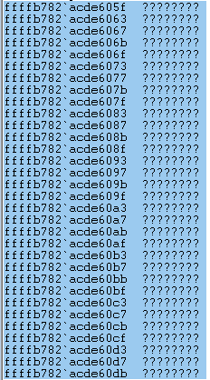

I've spent two days to make very detailed comments to almost every line of key functions

here is how windows 1903/1803 fucked up when dealing with SMB2 compression-enabled packet

## how illegal address is accessed

**srv2!Srv2DecompressData**:

I never said RCX is smbpacket, what I only know is that `[rcx+0F0h][18h]` is pointed to smb_header

why? because the data in `[rcx+0F0h][18h]` is the same as wireshark!

so now we know, RAX is a pointer which points to smb_header 

now smb_header is saved into `[rsp+30h]`, smb_header is 0x10bytes, so xmmword(0x10bytes width) is enough

we know `[rsp+30h]` is the very first byte of smb_header, so `[rsp+3Ch]` is 0xC offset in smb_header structure, which is `offset/length` field, value of this field is `0xffffffff`

a very big value(`0x000000010000000f`) is calculated here and passed to RDX

then this value is added to RAX (pointer of smb_header), RDX is now pointing to somewhere unknown

as the second parameter, RDX is passed to `srvnet!SmbCompressionDecompress`

**srvnet!SmbCompressionDecompress**:

R9 passed to `nt!RtlDecompressBufferEx2` as the fourth parameter

**nt!RtlDecompressBufferEx2**:

finally, function `nt!guard_dispatch_icall` will call `nt!RtlDecompressBufferLZNT1`

**nt!RtlDecompressBufferLZNT1**:

target system crashed

## why this address is illegal

