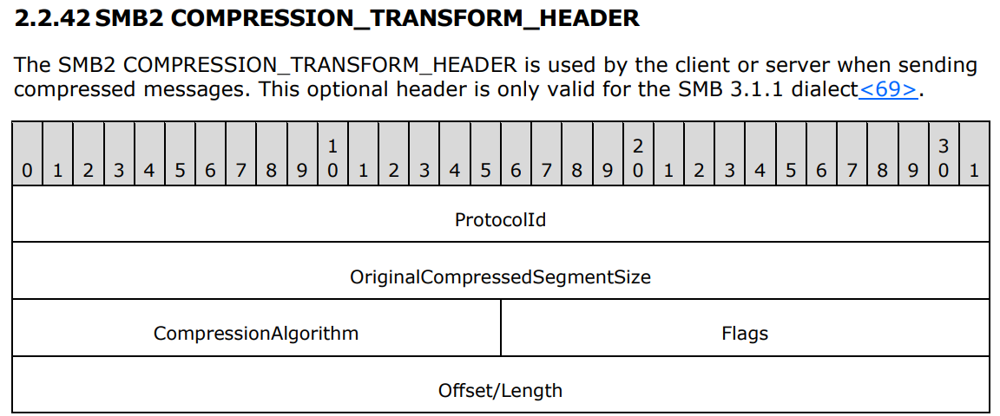
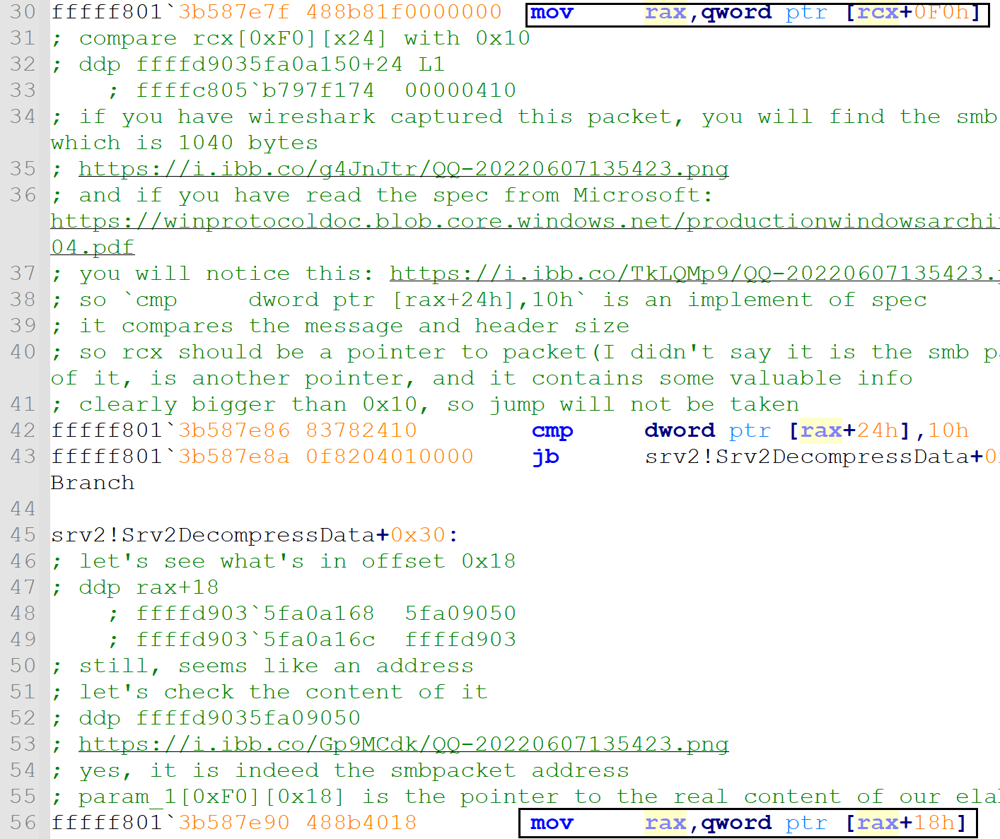
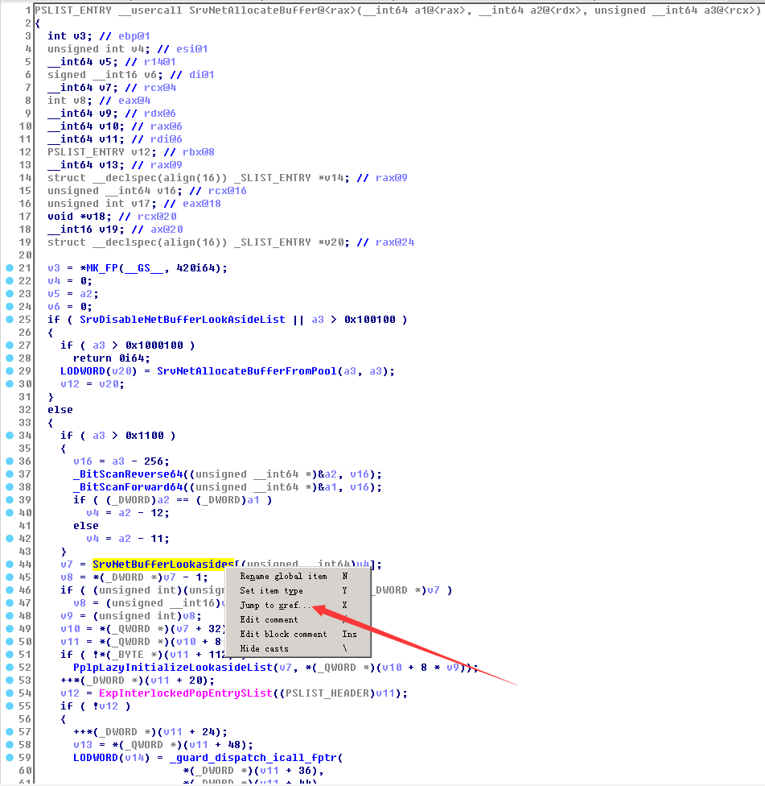
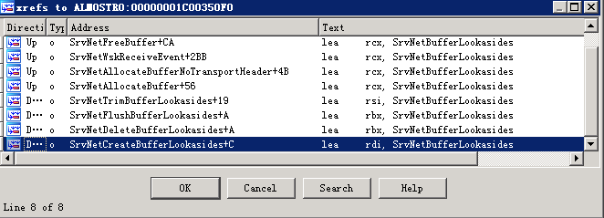
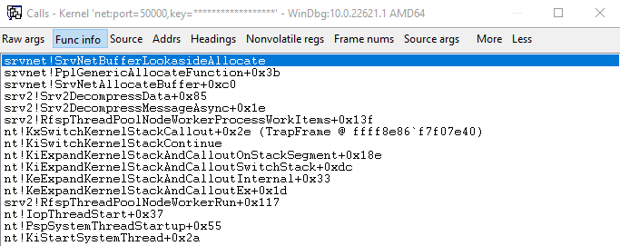

I've spent two days to make very detailed comments to almost every line of key functions

here is how windows 1903/1803 fucked up when dealing with SMB2 compression-enabled packet

## how illegal address is accessed

**srv2!Srv2DecompressData**:

I never said RCX is smbpacket, what I only know is that `[rcx+0F0h][18h]` is pointed to smb_header

why? because the data in `[rcx+0F0h][18h]` is the same as wireshark!

so now we know, RAX is a pointer which points to smb_header 

now smb_header is saved into `[rsp+30h]`, smb_header is 0x10bytes, so xmmword(0x10bytes width) is enough

we know `[rsp+30h]` is the very first byte of smb_header, so `[rsp+3Ch]` is 0xC offset in smb_header structure, which is `offset/length` field, value of this field is `0xffffffff`

a very big value(`0x000000010000000f`) is calculated here and passed to RDX

then this value is added to RAX (pointer of smb_header), RDX is now pointing to somewhere unknown

as the second parameter, RDX is passed to `srvnet!SmbCompressionDecompress`

**srvnet!SmbCompressionDecompress**:

R9 passed to `nt!RtlDecompressBufferEx2` as the fourth parameter

**nt!RtlDecompressBufferEx2**:

finally, function `nt!guard_dispatch_icall` will call `nt!RtlDecompressBufferLZNT1`

**nt!RtlDecompressBufferLZNT1**:

target system crashed

## why this address is illegal

because ECX is the allocated size, and ECX overflowed to a little value, it is less than what decompress function needs, so the memory address accessed in decompress function is illegal, as we all know, when user program access illegal memory, os kernel will kill it, so when kernel access illegal memory, crash happens

# lpe

now let's move to new level, evaluate ourself to system privilege

we need some help from IDA, first, I need to figure out how `SrvNetBufferLookasides` is created

use IDA to reverse srvnet.sys, find function `SrvNetAllocateBuffer`,

we chose `SrvNetCreateBufferLookasides` according to the function name

let's bp this function and fire up windbg

to trigger this bp, you need bp it during the target system booting, because `SrvNetCreateBufferLookasides` is created during system initiation

it is so hard, I'm drowning in the sea of kernel code, fuck!!!!!

I see nothing in this function, all buffer is allocated through `nt!ExAllocatePoolWithTagPriority`

not like they said, the custom buffer allocate function is never called, and I don't know how they get this conclusion

I don't know what the fuck I'm doing

I'm chasing the wrong rabbit, the custom function address is filled into `SrvNetBufferLookasides`, and it will be extract in `srvnet!SrvNetAllocateBuffer` function

the function `srvnet!SrvNetBufferLookasideAllocate` will be called during preparing response buffer and decompression buffer, here is the call stack

